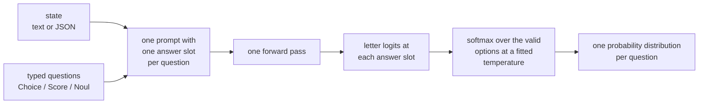

# decider: one-pass typed decisions with calibrated probabilities

[](https://github.com/Mapika/decider/actions/workflows/tests.yml)
[](https://huggingface.co/Mapika/decider-2b)
[](https://github.com/Mapika/decider/blob/main/LICENSE)

A language model that does not generate text. It reads a **state** and a set of **typed questions** and returns, from one
forward pass, a probability distribution for every question.

A typed decision is a question with a fixed answer set: **Choice** over 2 to 255 options, **Score** over 2 to 10 described
levels, or **Noul**, the probability of yes. There is no decoding, no parsing, and no output outside the options you defined.


*Recorded episodes; every move is one forward pass, and the bars are the served probabilities. Tetris: the harness shortlists
8 placements with a hand-tuned heuristic and states their consequences, and the model picks one (20 lines per game, against
0.6 for a random pick from the same 8). Pong uses an unreleased games-RL overlay. Sources, seeds and windows:
[docs/DEMOS.md](https://github.com/Mapika/decider/blob/main/docs/DEMOS.md).*

```bash
pip install decider-ai                  # the import name is decider
```

```python
from decider.infer import Decider
d = Decider("Mapika/decider-2b")        # downloads the weights on first use; CUDA, else MPS, else CPU
d.decide("My card was charged twice.", [{"question": "Which team?", "options": ["billing", "technical", "sales"]}])
# [{"choice": "billing", "confidence": 0.77, "probs": {"billing": 0.77, "technical": 0.19, "sales": 0.04}}]
```

The typed form (`system_one`), the HTTP server and GGUF loading are in [Quick start](#quick-start).

### Which model to use

| if you have | use | why |
|---|---|---|
| a GPU, and hard decisions (long policy texts, multi-hop reasoning) | [decider-12b](https://huggingface.co/Mapika/decider-12b) | 24 GB in bf16; JevBench public hard tier 0.712 (v1 0.730); Gemma-4-12B-it with a state-tracking LoRA merged in (v2), not measured on the regression set |
| a large GPU (62.5 GB of bf16 weights), and broad knowledge and reasoning | [decider-chat-gemma4-31b](https://huggingface.co/Mapika/decider-chat-gemma4-31b) | stock Gemma-4-31B-it with an option-count temperature; #2 of 70 on the Decision Index (57.33, ECE 0.047) |
| a smaller GPU | [decider-4b](https://huggingface.co/Mapika/decider-4b) | 8.4 GB in bf16; held-out accuracy 0.784 on the regression set, JevBench public hard tier 0.649 |
| a CPU or a laptop | [decider-2b-GGUF](https://huggingface.co/Mapika/decider-2b-GGUF) or [decider-4b-GGUF](https://huggingface.co/Mapika/decider-4b-GGUF) through llama.cpp, or [decider-2b](https://huggingface.co/Mapika/decider-2b) in PyTorch | Q4_K_M files of 1.3 GB (2B) and 2.7 GB (4B); on 8 server CPU threads a request of 40 to 120 tokens takes 0.12 to 0.31 s with the 2B and 0.3 to 0.7 s with the 4B |
| 65 GB of GPU memory, or 19.6 GB with NVFP4 in vLLM | [decider-35b-a3b](https://huggingface.co/Mapika/decider-35b-a3b) | held-out accuracy 0.810 on the regression set, JevBench public hard tier 0.676 |

Every model and its measurements: [Models](#models).

**Independence.** This is an independent project. It is not affiliated with or endorsed by TypeSafe AI. It is an open
reproduction of the "System One" model class (TypeSafe AI's *Jev*): a 2B model built on `Qwen/Qwen3.5-2B-Base`, a 4B model built on
`Qwen/Qwen3.5-4B-Base` and a 35B mixture-of-experts model built on `Qwen/Qwen3.5-35B-A3B-Base`. The training mixture is public datasets plus data labelled by a
local Qwen3.5-27B teacher (`teacher_data/`, `decider/data/mixture.py`). Nothing was distilled from Jev.

**Contents:** [Which model to use](#which-model-to-use) · [What's new](#whats-new) · [Standing](#standing) · [Models](#models) ·
[Runs on](#runs-on) · [Quick start](#quick-start) · [Train your own](#train-your-own) · [How it works](#how-it-works) ·
[Limits](#limits-stated-plainly) · [Results](https://github.com/Mapika/decider/blob/main/docs/RESULTS.md)

## What's new

* **2026-09-30 — decider-ai 1.8.1.** `decider.serve` bounds the shared-prefix forward for Gemma-4 and for long per-question
  suffixes. Decision Index retrieval requests with 32 documents of about 26k tokens ran out of memory in 1.8.0 even on a 268 GB
  GPU; they now read at 68.5 GB peak. New setting: `DECIDER_SHARED_SUFFIX_TOKENS` (65,536).
* **2026-09-29 — decider-ai 1.8.0 and two `decider-chat` model repositories.** `temperature_by_options` in
  `decider_config.json` sets T(n) = max(min, a + b ln n) for a question with n options. [Mapika/decider-chat-gemma4-31b](https://huggingface.co/Mapika/decider-chat-gemma4-31b)
  (#2 of 70 on the Decision Index, 57.33) uses it. [Mapika/decider-chat-qwen3.6-27b](https://huggingface.co/Mapika/decider-chat-qwen3.6-27b) (#8, 51.35) uses one temperature.
  Both are stock checkpoints plus a config. Replaying 300 stored index rows through `decider.serve` gives the stored answers on
  1,412 of 1,412 (Gemma) and 1,431 of 1,438 (Qwen) questions.
* **2026-09-29 — decider-12b v2.** [Mapika/decider-12b](https://huggingface.co/Mapika/decider-12b) now holds
  Gemma-4-12B-it with a merged LoRA (rank 32) trained on 6,000 generated state-tracking decisions and 4,000 replayed rows of
  our earlier data. New temperatures: Choice 1.5, Noul 0.05, Score 1.0. The stock-weights v1 stays under the tag `v1`.
  Results, v2 against v1:
  - Fresh held-out yes/no set, test half: v1.5 chance-corrected score 71.6 (58.8).
  - Held-out Choice accuracy on our generated and teacher rows: 0.615 (0.588).
  - JevBench public hard tier: 0.712 (0.730), 79 against 81 of 111 items; top-label ECE 0.147 (0.098).
* **2026-09-29 — decider-ai 1.7.1** (issue #18). The `numpy<2` pin is removed (it made the install fail on Windows ARM64).
  `Decider` and `decider.serve` default to float32 on CPU instead of bfloat16, which was about 13 times slower on a Snapdragon
  X Elite CPU. `scripts/serve.sh` listens on 127.0.0.1; `DECIDER_HOST=0.0.0.0` restores the old behaviour.
* **2026-09-29 — decider-12b and decider-ai 1.7.0.** [Mapika/decider-12b](https://huggingface.co/Mapika/decider-12b)
  is stock Gemma-4-12B-it read through the decider chat readout, with no training and per-type temperatures (Choice 4.0,
  Noul 1.0, Score 3.5). Results:
  - JevBench public items: 0.730 on the hard tier (decider-4b v2 0.676).
  - Fresh held-out yes/no set, v1.5 chance-corrected score: 61 (decider-4b v2 1).

  decider-ai 1.7.0 applies Gemma's final-logit softcapping to the letter logits. Earlier versions read Gemma checkpoints too
  sharply.
* **2026-09-27 — decider-ai 1.6.0: GGUF checkpoints in `Decider`.** `pip install "decider-ai[gguf]"`, then
  `Decider("Mapika/decider-4b-GGUF", gguf_file="decider-4b-v2.1-Q4_K_M.gguf")`: `decide` and `system_one` scored by llama.cpp
  (CPU, CUDA or Metal), with the per-type temperatures of the model's config ([GGUF](#gguf-llamacpp)). The GGUF files of the
  4B (v2.1) and the 2B (v11), each in Q4_K_M, Q8_0 and BF16, were published the same day (issue #16).

Earlier entries (decider-ai 1.0.2 to 1.5.0, decider-4b v1 to v2.1, decider-2b v1 to v11, decider-35b-a3b v1) are in
[docs/CHANGELOG.md](https://github.com/Mapika/decider/blob/main/docs/CHANGELOG.md), with the per-stage measurements in
[docs/HISTORY.md](https://github.com/Mapika/decider/blob/main/docs/HISTORY.md).

## Standing

Two third-party leaderboards rank this model class. Both were read on 2026-09-29; we did not run them.

**JevBench** v1.5.2 ([Benchmark Heaven](https://benchmarkheaven.com/jev-models), harness at
[fstandhartinger/jevbench](https://github.com/fstandhartinger/jevbench)). 99 ranked systems. The score is a harmonic mean of
four axes, with a penalty on an axis below 50. Half of Intelligence comes from 720 sealed decisions. Speed and cost are
measured from the operator's server.

| system | score | intelligence | calibration | speed | cost |
|---|---|---|---|---|---|
| Cygnet (stock Gemma-4-12B-it, #1) | 73.7 | 71.1 | 87.0 | 91.0 | 56.4 |
| Winnow-12B Q8 (#2) | 73.2 | 74.4 | 84.1 | 86.1 | 56.6 |
| Jev 1.13.0 (#3) | 72.1 | 72.0 | 88.0 | 83.8 | 54.7 |
| **decider-4b v2** (#7) | 71.3 | 55.8 | 85.6 | 90.9 | 64.5 |
| **decider-2b** (#28) | 45.1 | 42.3 | 71.5 | 94.4 | 64.9 |
| **decider-35b-a3b** (#41) | 27.5 | 60.5 | 82.0 | 91.0 | 34.4 |

- decider-4b v2 is held back by Intelligence on the sealed yes/no (Noul) items: 43 open against 19 sealed, chance-corrected.
- The 35B is gated by cost: it is priced at the base model's hosted price.
- [decider-12b](https://huggingface.co/Mapika/decider-12b) is submitted
  ([jevbench #155](https://github.com/fstandhartinger/jevbench/issues/155)) and not yet measured. It uses the same base as
  Cygnet. The weights were updated to v2 (state-tracking LoRA) after submission.

**Decision Index** edition v0.2.1, 2026-09-28 ([leaderboard](https://multimodalart-jev-decision-index.static.hf.space), kit at
[apolinario/decision-index](https://github.com/apolinario/decision-index)). 70 entries, 43 benchmarks. The score is
chance-corrected (0 is random guessing).

| system | score | rank | ECE |
|---|---|---|---|
| Jev 1.13.0 (listed separately) | 57.91 | | |
| Surogate Rune 26B-A4B v3 (full fine-tune) | 57.44 | 1 | 0.120 |
| **[decider-chat-gemma4-31b](https://huggingface.co/Mapika/decider-chat-gemma4-31b)** (stock Gemma-4-31B-it, our readout) | 57.33 | 2 | 0.047 |
| AutoJev-27B (full fine-tune) | 56.40 | 3 | 0.018 |
| **[decider-chat-qwen3.6-27b](https://huggingface.co/Mapika/decider-chat-qwen3.6-27b)** (stock Qwen3.6-27B, our readout) | 51.35 | 8 | 0.021 |
| **decider-35b-a3b (NVFP4)** | 47.11 | 12 | 0.023 |
| **decider-4b** | 40.70 | 19 | 0.084 |
| **decider-2b** | 28.97 | 37 | 0.077 |

The two `decider-chat` rows are stock instruct models read through this package's chat layout with a temperature fitted on our
own rows. The index lists them as inference techniques. On the index the base model sets most of the score: our trained 35B,
4B and 2B are below these two stock models read the same way.

### Where Jev leads

The gap to Jev is the knowledge area. Per-area scores on the Decision Index panel, decider-35b-a3b against Jev:

| area | decider-35b-a3b | Jev |
|---|---|---|
| knowledge (GPQA, GSM8K, CRUXEval, MMLU) | 0.51 | 0.69 |
| language | 0.61 | 0.62 |
| retrieval | 0.34 | 0.37 |
| tools | 0.72 | 0.73 |
| arts | 0.53 | 0.56 |

Language, retrieval, tools and arts are within 0.03. Knowledge is 0.18 behind, on GPQA, GSM8K, CRUXEval and MMLU. The same
weakness shows on JevBench's 111 public hard items, which are long policy texts, multi-hop and temporal-numeric reasoning:
decider-35b-a3b 0.676, decider-4b v2.1 0.649 and decider-2b v11 0.577 against Jev's 0.730; decider-12b v1 (stock Gemma-4-12B-it) reaches 0.730 and v2 0.712 (our runner and the harness's own per-task file, same items). The other axis we lose there is calibration on hard items; see
[Limits](#limits-stated-plainly).

## Models

Held-out means no example of that dataset was trained on. The regression set has 28 held-out tasks, the 94-task set 24; the
two are not comparable to each other, and the NVFP4 row is measured against the bf16 build rather than on a held-out set.
[docs/RESULTS.md](https://github.com/Mapika/decider/blob/main/docs/RESULTS.md) has all of them in full.

| model | base | parameters | context | held-out accuracy | weights |
|---|---|---|---|---|---|
| decider-2b **v11** | Qwen3.5-2B-Base | 1.9B | 32k tokens | 0.752 (regression set) | [Mapika/decider-2b](https://huggingface.co/Mapika/decider-2b) |
| decider-4b **v2.1** | Qwen3.5-4B-Base | 4.2B | 32k tokens | 0.784 (regression set) | [Mapika/decider-4b](https://huggingface.co/Mapika/decider-4b) |
| decider-12b **v2** | Gemma-4-12B-it + merged state-tracking LoRA (rank 32) | 12B | 32k tokens | not measured on the regression set; JevBench public hard 0.712 | [Mapika/decider-12b](https://huggingface.co/Mapika/decider-12b) |
| decider-chat-gemma4-31b | Gemma-4-31B-it (unchanged weights), T(n) = max(0.05, 10.124 − 1.633 ln n) | 31B | 32k tokens | Decision Index v0.2.1: 57.33, #2 of 70 | [Mapika/decider-chat-gemma4-31b](https://huggingface.co/Mapika/decider-chat-gemma4-31b) |
| decider-chat-qwen3.6-27b | Qwen3.6-27B (unchanged weights), T 1.943 | 27B | 32k tokens | Decision Index v0.2.1: 51.35, #8 of 70 | [Mapika/decider-chat-qwen3.6-27b](https://huggingface.co/Mapika/decider-chat-qwen3.6-27b) |
| decider-35b-a3b **v1** | Qwen3.5-35B-A3B-Base | 34.7B total, 3B active | 32k tokens | 0.810 (regression set) | [Mapika/decider-35b-a3b](https://huggingface.co/Mapika/decider-35b-a3b) |
| decider-4b-GGUF | decider-4b v2.1 in Q4_K_M (2.7 GB), Q8_0, BF16 | 4.2B | 32k tokens | Q4_K_M 0.783, Q8_0 0.783 against 0.784 (regression set) | [Mapika/decider-4b-GGUF](https://huggingface.co/Mapika/decider-4b-GGUF) |
| decider-2b-GGUF | decider-2b v11 in Q4_K_M (1.3 GB), Q8_0 (2.0 GB), BF16 | 1.9B | 32k tokens | Q8_0 0.752, Q4_K_M 0.747 against 0.752 (regression set) | [Mapika/decider-2b-GGUF](https://huggingface.co/Mapika/decider-2b-GGUF) |
| decider-35b-a3b-nvfp4 | the 35B in NVFP4, 19.6 GB | 34.7B total, 3B active | 32k tokens | 1.0 to 1.5 points under bf16 in vLLM | [Mapika/decider-35b-a3b-nvfp4](https://huggingface.co/Mapika/decider-35b-a3b-nvfp4) |
| decider-0.8b | Qwen3.5-0.8B-Base | 0.8B | 32k tokens | 0.71 (94-task set) | [Mapika/decider-0.8b](https://huggingface.co/Mapika/decider-0.8b) |
| decider-2b-vision | Qwen3.5-2B vision-language, v5 text weights | 1.9B | 32k tokens | Visual7W 0.89 (see MODEL_CARD_VISION.md) | [Mapika/decider-2b-vision](https://huggingface.co/Mapika/decider-2b-vision) |

decider-2b v10 and v8 stay available under the Hub tags `v10` and `v8` of Mapika/decider-2b, and decider-4b v2 and v1 under the
tags `v2` and `v1` of Mapika/decider-4b. decider-4b is the first model trained on mixture v2 (the public mixture
plus 26 further public decision datasets and ten programmatic families with verifiable gold); the mixture-v2 builders are not
yet in this package, `scripts/train.sh full` reproduces the public 60% of its data. decider-2b-vision has a
[browser demo](https://huggingface.co/spaces/hugging-apps/decider-2b-vision-demo), a Space built by the Hugging Face team.

## Runs on

* **CUDA.** bf16, `torch.compile`, shape-bucketed CUDA graphs, optional FP8 (e4m3) linears. The 2B needs about 4 GB, the 4B 8.4 GB, the 35B
  65 GB in bf16 or 19.6 GB in NVFP4.
* **Apple Silicon, MPS.** Acceleration for the dense models (0.8B, 2B, 2B vision), merged 2026-09-22 from pull request #2 by
  **@simply-sunny**. On an M1 Pro in float16, across the
  three 2B smoke-test workloads, the median request is 133 ms with the patch and 171 ms without it; on the held-out MASSIVE
  Scenario set (1,500 examples, temperature 1.30) the MPS path scores accuracy 0.7553 and ECE 0.0438 against the published
  bf16 row's 0.756 and 0.041. Conditions: `docs/benchmarks/mps-full-model.md`, `docs/benchmarks/mps-heldout.md`.
* **llama.cpp (GGUF).** Since decider-ai 1.6.0, `Decider` loads the GGUF files of the 4B and 2B
  ([GGUF](#gguf-llamacpp)) and scores them with llama-cpp-python (CPU, CUDA or Metal build). On 8 server CPU threads a request of
  40 to 120 tokens takes 0.3 to 0.7 s with the 4B in Q4_K_M and 0.12 to 0.31 s with the 2B. The HTTP server does not serve GGUF
  files, and torch is still installed (decider-ai depends on it).
* **CPU.** The library and the HTTP server run on CPU in float32 (since 1.7.1; bfloat16 was about 13 times slower on a Windows ARM64 CPU, issue #18), eager; the unit tests run without a GPU: `python -m pytest tests`.
* **Snapdragon X Elite NPU (community port).** **@esterhuizen** runs decider-12b v2 entirely on the Hexagon NPU through
  ONNX Runtime QNN, with 4-bit LPBQ weights and the decider-ai 1.8.1 prompt and readout (issue #18). Their measurements, on one
  X Elite (HTP v73): about 2.2 s per request, 576 tokens per pass, the same answer as a PyTorch fp32 reference on 6 of 6 rows,
  and JevBench public items easy 1.000, standard 0.986, hard 0.717 on the 53 hard items that fit in 576 tokens. Code and write-up:
  [esterhuizen/system-one-on-snapdragon](https://github.com/esterhuizen/system-one-on-snapdragon) (`decider-npu/`,
  docs/WINNOW-NPU.md); NPU files: [tielmane/decider-12b-NPU-LPBQ-X-Elite](https://huggingface.co/tielmane/decider-12b-NPU-LPBQ-X-Elite).

## Quick start

```bash
pip install decider-ai                                     # or: git clone https://github.com/Mapika/decider && pip install -e ".[serve]"
```

On Apple Silicon, `pip install "decider-ai[metal]"` adds the optional MLX/Metal kernel. Without it, MPS inference uses the PyTorch implementation.

```python
from decider.infer import Decider
d = Decider("Mapika/decider-2b")                             # bf16 on CUDA (about 4 GB), float16 on MPS, float32 on CPU
d.system_one(
    {"ticket": {"messages": [{"from": "customer", "text": "I was charged twice for order A-104. Please refund the duplicate."}]},
     "refund_policy": "Duplicate charges are eligible for a refund."},
    {"department": {"type": "choice", "instructions": "Which team should handle this?",
                    "criteria": {"returns": "Exchanges, refunds, wrong or damaged items", "billing": {"what": "Charges, invoices", "not_for": "delivery"}, "other": None}},
     "refund_requested": {"type": "noul", "instructions": "Does `ticket.messages[0].text` request a refund?"},
     "frustration": {"type": "score", "instructions": "How frustrated is the customer?", "criteria": ["calm", "frustrated", "very frustrated"]}})
# {"answers": {"department": {"choice": "billing", "confidence": 0.34, "x_p_max": 0.56, "certainty": 0.37, "probabilities": {"returns": 0.44, "billing": 0.56, "other": 0.00}},
#              "refund_requested": {"noul": 0.99},
#              "frustration": {"score": 0.76, "probabilities": {"0": 0.34, "1": 0.55, "2": 0.10}, "level_fit": {"0": 0.34, "1": 0.55, "2": 0.10}, "fit_mass": 0.99}}}
#                                                             (v10 weights; "returns" also mentions refunds, so the mass is split)

d.decide("My card was charged twice.", [{"question": "Which team?", "options": ["billing", "technical", "sales"]}])
# [{"choice": "billing", "confidence": 0.77, "probs": {"billing": 0.77, "technical": 0.19, "sales": 0.04}}]      the plain form
```

### GGUF (llama.cpp)

```bash
pip install "decider-ai[gguf]"          # llama-cpp-python; for a GPU: CMAKE_ARGS="-DGGML_CUDA=on" (or -DGGML_METAL=on) pip install ...
```

On Windows on ARM (Snapdragon X), llama-cpp-python does not build with MSVC. Install the Visual Studio Build Tools component
"C++ Clang tools for Windows" and build with clang, `-DGGML_OPENMP=OFF` and no GPU backend. On a Snapdragon X Elite this build
ran decider-2b v11 Q8_0 at about 220 ms per 3-question request on 8 threads. The build recipe and measurements are in
[esterhuizen/system-one-on-snapdragon](https://github.com/esterhuizen/system-one-on-snapdragon) (docs/FINDINGS.md), from issue #18.

```python
from decider.infer import Decider
d = Decider("Mapika/decider-4b-GGUF", gguf_file="decider-4b-v2.1-Q4_K_M.gguf")      # 2.7 GB; or a local path to a .gguf file
d.decide("My card was charged twice.", [{"question": "Which team?", "options": ["billing", "technical", "sales"]}])
d.system_one(state, questions)                                                       # as above
```

The GGUF files are not chat models: loading one in `llama-cli` or Ollama gives a text model, not decisions. The tokenizer and
`decider_config.json` come from the same repository or folder as the `.gguf` file. `gguf_options` passes
`n_ctx`, `n_gpu_layers` (-1, the default, offloads every layer when the build has a GPU; 0 is CPU only) and `n_threads` to
llama.cpp. Rows are scored one per llama.cpp decode: packing several rows into one decode (`n_seq_max`) is faster but moves
the probabilities with the other rows in the batch, by up to 0.16 in Q4_K_M. `schema()` (the questions-first cache) needs the
torch engine. Measured quality per file is on the model cards (decider-4b Q8_0 equal to bf16, Q4_K_M 0.2 points lower in-task).

`confidence` on a Choice or Score answer follows TypeSafe's definition since decider-ai 1.3.0. For a Choice with n options it is
`(n·p_max − 1)/(n − 1)`, where p_max is the largest probability: 0 when the probabilities are uniform, 1 when one option has all
of them. For a Score it is `max(0, 1 − Σ pᵢ·|i − k| / D)`, where k is the most likely level and
`D = (1/n)·Σ |i − (n − 1)/2|` is the mean distance of the n levels from the middle of the scale. Before 1.3.0, `confidence` was p_max. `x_p_max` reports p_max on every Choice and Score answer; if
you tuned thresholds on `confidence` before 1.3.0, compare them with `x_p_max` instead. A Noul answer has no `confidence`; its
`noul` value is the probability of yes. A Noul question may omit `instructions` if its `criteria` describe true or false.

`examples/` has three complete programs: confidence-gated routing, composite scoring, and a hierarchical beam over Choice
probabilities.

### HTTP server

```bash
scripts/serve.sh Mapika/decider-2b 8000          # listens on 127.0.0.1; DECIDER_HOST=0.0.0.0 opens it to the network (no authentication)
```

`POST /v1/systemone` is TypeSafe's wire format, so their SDKs work unchanged with `TYPESAFE_BASE_URL=http://localhost:8000`;
`POST /decide` is the plain form. The server picks its device as `Decider` does (CUDA, else MPS, else CPU; `DECIDER_DEVICE`
overrides it). On CUDA it captures a CUDA graph for every (batch, length) shape at start-up, so on the default path no
request compiles or captures a graph; on MPS and CPU every request runs eager; requests over its size limits get HTTP 413 and an overloaded server
answers 503 (limits, defaults and measurements in `docs/SERVING.md`). The schema cache (a schema seen twice gets a cached prefix
and its own graphs, captured the first time that schema is used) is on only for a model whose `decider_config.json` sets
`schema_first`, or with `DECIDER_SCHEMA_CACHE=1`.

### Serving a large stock model on vLLM

`decider.serve_vllm` (1.5.0) serves the same `/v1/systemone` readout on vLLM 0.29.0, for large checkpoints such as a stock
instruct model read in the chat layout. vLLM 0.29.0 pins its own torch, so it goes in its own environment:

```bash
python -m venv decider-vllm && . decider-vllm/bin/activate
pip install vllm==0.29.0 fastapi "uvicorn[standard]" jinja2 huggingface_hub
pip install --no-deps decider-ai
DECIDER_MODEL=Qwen/Qwen3.6-27B DECIDER_LAYOUT=chat DECIDER_TEMPERATURE=1.943 DECIDER_VLLM_GPU_MEMORY_UTILIZATION=0.90 \
    uvicorn decider.serve_vllm:app --host 127.0.0.1 --port 8000
```

It answers independent `/v1/systemone` questions only (`/decide` and the schema cache stay `decider.serve` features). Design,
limits and measurements: `docs/SERVING.md` section 8.

### Temperatures in `decider_config.json`

Every answer is a softmax over its option letters divided by a temperature from the model's `decider_config.json`:

| key | meaning |
|---|---|
| `temperature` | one value for every answer (default 1.0) |
| `temperature_by_type` | optional, decider-ai 1.4.0 and later: `{"choice": T, "noul": T, "score": T}`; a missing type uses `temperature` |
| `temperature_schema_first` | optional: the schema cache (questions-first layout); without it the cache uses the two keys above |
| `temperature_schema_first_by_type` | optional, 1.4.0 and later: per type on the schema cache; a missing type uses `temperature_schema_first` |

The keys of the maps are the `/v1/systemone` question types. A `/decide` field of type `bool` is a `noul`, `scale` is a
`score`, `choice` is a `choice`; `Decider.decide()` questions are `choice`. A Score question read with isolated levels (one
yes/no row per level) uses the `score` temperature on each of its level rows, because the rows form one Score answer.
Every value must be a finite number > 0, and any other key in a map is refused when the model is loaded.
`Decider(path, temperature=T)` and `DECIDER_TEMPERATURE` replace `temperature` and switch `temperature_by_type` off.
decider-4b v2.1, decider-2b v11 and decider-12b have a map. decider-chat-gemma4-31b has `temperature_by_options`: `{"a": 10.124, "b": -1.633, "min": 0.05}` gives T(n) = max(min, a + b ln n) for a question with n options, and replaces `temperature` and the map on the state-first layout (1.8.0). The other released models have one `temperature`. decider-ai 1.3.0 and earlier
ignore the map and use `temperature` for every answer. `python -m decider.calibrate records.jsonl` fits the map by NLL
from answers read at temperature 1 (record format in `decider/calibrate.py`). `/health` reports the temperature each type gets.

## Train your own

```bash
uv venv --python 3.12 .venv312 && uv pip install -p .venv312/bin/python -e ".[serve,train]"
scripts/train.sh full                       # datasets -> data/tasks.pkl -> data/mixture_full.pkl -> one epoch from Qwen3.5-2B-Base -> scripts/evaluate.sh
scripts/train.sh delta runs/some/model      # or: continue an existing decider checkpoint on the new formats + a replay sample
```

The full recipe and the data builders are in this repository: `decider/data/` downloads and converts about 95 public datasets
and assembles the mixture (`decider/data/mixture.py` lists every component with its size), `decider/train.py` is the
fine-tune, `scripts/evaluate.sh` scores it. One epoch is 1.47M examples and 455M tokens, 5.3 h on a GH200 plus 45 min of
evaluation, and it reproduces the released supervised weights: it matches v9 on the 94-task set (in-task 0.809 against 0.812,
held-out 0.739 against 0.741) and every probe family within noise, with a fitted temperature of 1.03 instead of 1.36.

The RL stage that turns v8 into v10 ([docs/RL.md](https://github.com/Mapika/decider/blob/main/docs/RL.md)) needs a live Chrome with MiniWoB++, the exact game environments
and the training loop of a separate research repository; it is not in this package yet.

## How it works



`decider/prompt.py` renders a request as text with one answer slot per question. `decider/model.py` reads the hidden state at
each slot, projects it onto one label token per option (A-J, then K-Z and two-letter tokens up to 255) and softmaxes over the
valid ones. Letters are never generated, so all slots come out of one pass. The temperature is fitted once on in-task data and
checked on held-out tasks. Every question can also be scored in its own row, and then adding, removing or reordering questions
cannot change another answer; every Score level is judged alone, without its number or its neighbours.

Two prompt layouts are trained, 50/50. **State-first** (`Context ... Question ... Options ... Answer: (`) is the default.
**Schema-first** puts the question and option blocks before the state, so they form a prefix that does not depend on the
state: `decider/schema_engine.py` runs that prefix once per schema, keeps its cache read-only, and a request then runs only
`Context: <state>` plus the slots, as a CUDA graph per (batch, length) bucket. Schema-first trades accuracy for speed, so the
cache is opt-in; the cost is measured in [docs/RESULTS.md](https://github.com/Mapika/decider/blob/main/docs/RESULTS.md).

### Calibration


Calibration is what the v10 RL objective trains directly. For every action in a game with a known probability law the model
is asked what will happen next, and its answer is scored against the exact law with a log score: v10 is 0.22 nats above the
law where v8 was 0.47. In the browser it predicts the outcome of its own click at a log score of −0.03 against −0.35.

## Limits, stated plainly

* **One pass cannot do multi-step arithmetic.** There is no chain of thought and no intermediate state, so GSM8K-type items,
  temporal arithmetic and multi-hop chains are out of reach. Split such a judgment into several questions.
* **Calibration on hard items is the weak axis.** decider-2b v10's top-label ECE on JevBench's public hard items is 0.31: it is
  confident where it is wrong there, and its calibration score on the JevBench leaderboard is 46.6. decider-2b v11 is at 0.18 there, decider-4b
  v2.1 at 0.18, the 35B at 0.15 and decider-4b v2 at 0.10 (0.07 at its release temperature). On our own held-out generated
  families v2.1 and v11 are at 0.15 and 0.16 against a limit of 0.08 that we set for release.
* **Knowledge-heavy multiple choice.** decider-2b improves little over its base model on MMLU and MedQA. decider-4b is higher
  (v2: MMLU +11, MedQA +13 points over decider-2b v10) and decider-35b-a3b more (MMLU +19 points) at 3 to 4 times the cost per
  decision; decider-4b v2.1 is at 0.649 and the 35B at 0.676 on JevBench's public hard tier, and neither has the RL stage.
* **Optimizer setting on the 35B.** decider-35b-a3b was trained with FP32 master weights (Muon on the block matrices, AdamW
  elsewhere). In later controlled runs that setting moved small models further from their base than the same schedule
  without a master copy, and cost accuracy on knowledge tasks. The 2B and the 4B were trained without a master copy and are not affected.
  A 35B retrain without it is planned.
* **English only.** Calibration is measured on public datasets and teacher-labelled probes, not on your traffic.
* **The schema cache costs accuracy.** Use it for fixed classification-style schemas with short states; see docs/RESULTS.md.
* **Generic options need to look like buckets.** v10 and v11 continue the v8 weights, so the v9 terse-bucket result (generic
  0.86) does not apply to them; v8's 0.59 does. A plain `support` next to `other` sends an in-scope complaint to `other`.
* **Rules written into the question are not followed at this size.** On the form-filling probe a one-sentence question scores
  0.67 and a paragraph of rules 0.24. A fixed convention has to be in the training data, not in the question.
* **Picking a record out of a long JSON array by position is the least accurate input shape** (0.51 with 64 records against
  0.70 with one). Address records by key, or let `render_state` write the index into the array (0.62).
* **Known regressions.** TREC-fine with all 50 labels fell from 0.76 (v6) to 0.72 (v8). Held-out Freeway play fell to 0 and
  did not come back when the game data was replayed. OpenJev is 0.8 points lower on v10 than on v8. decider-2b v11 against v10:
  human-labelled public sets −2.2 points, knowledge guard −1.6, greedy bag-draw play −10.9, sampled browser play −2.8 (interval
  includes zero). decider-4b v2.1 against v1: BabyAI-GoTo 0.19 against 0.54, greedy bag-draw play −9.4, and issue #9's form case
  c_1 is answered wrongly.
* **Teacher bias.** The custom-question data is labelled by a 27B teacher that shares some of the biases it is meant to fix;
  it agreed with only 72% of its own generic-option labels. `decider/data/mixture.py` shows how they are filtered.
* **Browser results are narrow.** They are on the 22 click-only MiniWoB++ tasks: small synthetic pages, elements listed as
  text. Typing, scrolling and real websites were not tested.
* **The vision variant** (`decider/vision`) is still on v5 text weights and is retraining.
* **Reproduction is not byte-identical.** The released weights were produced by staged continuation runs; `scripts/train.sh
  full` reproduces the supervised stages in one run, and the 16-to-60-case hand-written probes move by a few cases either
  way.

## Repository layout

```
decider/prompt.py        the two prompt layouts, label table, answer slots
decider/model.py         DecisionModel: backbone -> slot hidden states -> option logits
decider/systemone.py     Choice / Score / Noul with criteria -> prompt rows; typed answers; isolated levels
decider/infer.py         Decider: system_one(), schema() (compiled, cached question sets), decide()
decider/engine.py        CUDA graphs, torch.compile, shared-prefix scoring;  fp8.py, schema_engine.py, mps_ops.py, mps_moe.py
decider/engine_gguf.py   GGUFEngine: the same readout on llama.cpp through llama-cpp-python
decider/calibrate.py     fits the per-type temperatures from labelled answers
decider/serve.py         HTTP server: /v1/systemone, /decide, continuous batching
decider/serve_vllm.py    HTTP server on vLLM 0.29.0: /v1/systemone for large stock or chat-layout models;  vllm_worker.py
decider/data/            ~95 public datasets, input-shape augmentations, the mixture, the 27B teacher data
decider/train.py         cross-entropy fine-tune;  evaluate.py  accuracy / NLL / Brier / ECE / AURC per task
decider/probes/          hand-written batteries, question independence, isolated levels
decider/bench/           engine, schema-cache and MPS benchmarks, HTTP load test, Bespoke's public suite
decider/games/           ten text games + Super Mario Bros behind the same interface, imitation and PPO
decider/vision/          the vision-language variant (decisions from pixels)
moe/                     frozen-expert Muon training, evaluation and NVFP4 quantization for decider-35b-a3b
scripts/  examples/  tests/  teacher_data/  media/
docs/                    RESULTS.md (every measurement), CHANGELOG.md, HISTORY.md, RL.md, SERVING.md, DEMOS.md, benchmarks/ (MPS)
```

## Citation

```bibtex
@software{marosi2026decider,
  author = {Marosi, Mark},
  title  = {decider: one-pass typed decisions with calibrated probabilities},
  year   = {2026},
  url    = {https://github.com/Mapika/decider}
}
```

## License

Apache 2.0. See [LICENSE](https://github.com/Mapika/decider/blob/main/LICENSE).
